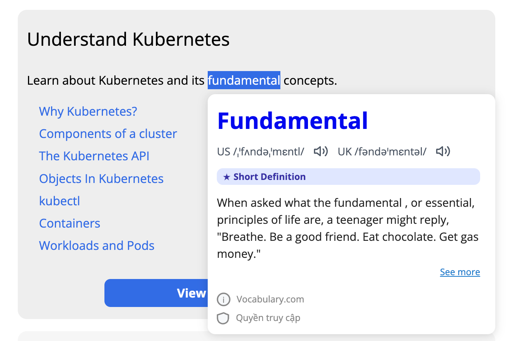

# 📖 Vocabulary Chrome Extension



> **Deep English definitions at your fingertips – Learn in context, without breaking your reading flow.**

---

## 😫 The Pain Point: "The Tab-Switching Tax"

We've all been there: you're deep in a research paper, a news article, or a technical blog. You hit a word like *ephemeral* or *cogent*.

Current workflows involve:
1.  **Stop reading.**
2.  **Open a new tab.**
3.  **Navigate to a dictionary.**
4.  **Type the word (and pray you spelled it right).**
5.  **Scan for the right definition.**
6.  **Try to remember where you were in the article.**

**Result:** Your reading flow is broken, your concentration is gone, and you’re less likely to remember the word later.

---

## ✨ The Solution: In-Context Learning

**Vocabulary Chrome Extension** eliminates the "Tab-Switching Tax" by bringing high-quality definitions directly to your text selection.

- **Highlight & Reveal:** Just select any word to get an instant, non-intrusive popup.
- **Stay in the Zone:** Read the definition, understand the nuance, and continue reading—all in seconds.
- **Deep Definitions:** Powered by **Vocabulary.com**, giving you more than just a synonym—you get the "why" and "how" of the word's usage.

---

## 🎯 Who is this for?

Designed for users who read English at a B1 to C2 level and want to expand their vocabulary naturally:

*   🎓 **The Student:** Preparing for **IELTS, TOEFL, SAT, or GRE**? Get academic definitions and usage examples on any study material.
*   💼 **The Professional:** Reading technical docs, legal papers, or industry news? Quickly grasp specialized terminology without losing focus on your work.
*   📖 **The Lifelong Learner:** An avid reader who wants to move beyond "roughly understanding" a sentence to truly mastering its vocabulary.

---

## 🌟 Key Features

- **Definition-First UI:** Prioritizes academic English definitions over simple machine translation.
- **Instant Lookup:** High-quality data from **Vocabulary.com** (headword, pronunciation, and detailed definitions).
- **Smart Normalization:** Automatically handles punctuation, casing, and extraneous characters to ensure accurate lookups.
- **Auto-Popup Toggle:** Full control over your experience—enable it for deep reading sessions, or disable it for casual browsing.
- **Privacy-Centric:** No personal data collection, minimal permissions (`activeTab`, `storage`), and transparent data handling.

---

## 🛠️ Installation (Developer Mode)

Since this extension is in active development, you can load it as an "unpacked" extension in Chrome:

### 1. Build the Extension
Ensure you have [Node.js](https://nodejs.org/) installed, then run:

```bash
# Install dependencies (only needed once)
npm install

# Build the production-ready assets
npm run build
```
This will create a `dist/` folder containing the bundled extension.

### 2. Load into Chrome
1.  Open your Chrome browser and navigate to: `chrome://extensions/`
2.  Enable **Developer mode** (toggle in the top-right corner).
3.  Click the **Load unpacked** button.
4.  Select the `dist/` folder from this repository.

*You're all set! Highlight any word on any webpage to start learning.*

---

## 🧑‍💻 For Developers

### Technical Stack
- **Manifest V3:** Modern, secure extension architecture.
- **esbuild:** Lightning-fast bundling for content scripts.
- **Node Test Runner:** Built-in unit testing for reliability.

### Useful Commands
- `npm test`: Run unit tests.
- `npm run quality:gate`: Perform a full release check (test, audit permissions, and build).
- `npm run build`: Rebuild the `dist/` folder after making changes.

---

> "Highlight to look up, learn to remember, trust through transparency."
