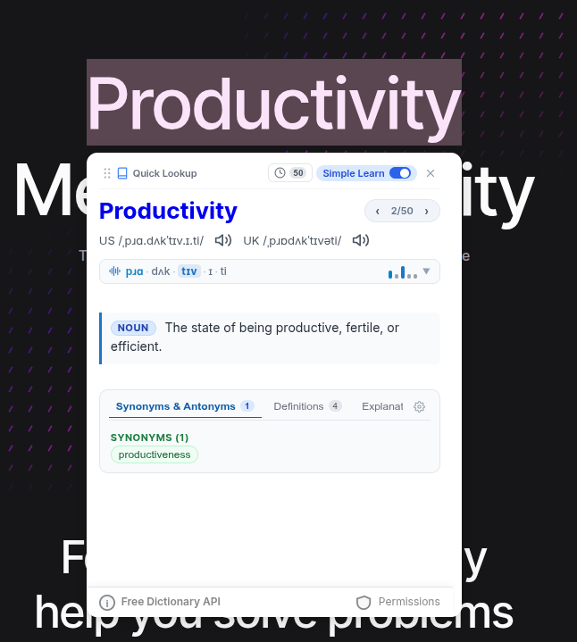
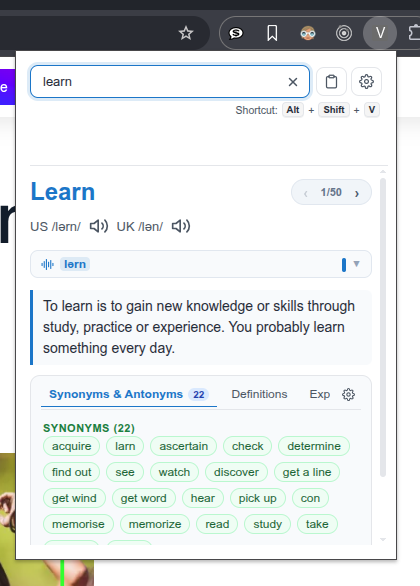
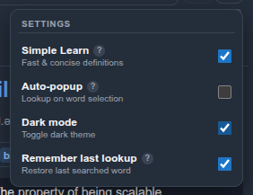

# 📖 Vocabulary Chrome Extension

<div align="center">



> **Deep English definitions at your fingertips – Learn in context, without breaking your reading flow.**

</div>

---

## 😫 The Pain Point: "The Tab-Switching Tax"

We've all been there: you're deep in a research paper, a news article, or a technical blog. You hit a word like *ephemeral* or *cogent*.

Current workflows involve:
1. **Stop reading.**
2. **Open a new tab.**
3. **Navigate to a dictionary.**
4. **Type the word (and pray you spelled it right).**
5. **Scan for the right definition.**
6. **Try to remember where you were in the article.**

**Result:** Your reading flow is broken, your concentration is gone, and you’re less likely to remember the word later.

---

## ✨ The Solution: In-Context Learning

**Vocabulary Chrome Extension** eliminates the "Tab-Switching Tax" by bringing high-quality, academic definitions directly to your text selection.

- **Highlight & Reveal:** Select any word on any webpage to get an instant, non-intrusive lookup modal.
- **Stay in the Zone:** Read the definition, understand nuances, and continue reading—all in seconds.
- **Dual Learning Engines:** Switch between deep explanatory context and fast, concise definitions on the fly.

---

## 🎯 Who is this for?

Designed for users who read English at an intermediate to advanced level (B1 to C2) and want to expand their vocabulary naturally:

* 🎓 **The Student:** Preparing for **IELTS, TOEFL, SAT, or GRE**? Get academic explanations, synonyms, and usage examples directly on your study materials.
* 💼 **The Professional:** Reading technical documentation, research papers, or industry news? Quickly grasp specialized terminology without losing context.
* 📖 **The Lifelong Learner:** An avid reader who wants to move beyond "roughly understanding" to truly mastering English vocabulary.

---

## 🌟 Key Features

### 🔄 Dual-Engine Learning Modes (Simple Learn)
- **Deep Explanatory Mode (Default)**: Powered by **Vocabulary.com**, providing rich, narrative explanations, real-world context, and word family relations with automatic fallback to FreeDictionary API.
- **Simple Learn Mode**: Toggle **Simple Learn** on for rapid, concise definitions, direct part-of-speech breakdowns, and native audio.

---

### 📑 Interactive & Customizable Tabbed Interface
- **Connected Underline Tab Bar**: Cleanly organizes content into **Explanation**, **Definitions** (by Part-of-Speech), **Thesaurus**, and **Word Family**.
- **Drag-and-Drop Tab Customization**: Reorder tabs via an intuitive modal or hide tabs you rarely use, with a built-in one-click **Reset to default**.
- **Full Keyboard Navigation**: Switch between tabs smoothly using arrow keys (`←`, `→`, `↑`, `↓`).

---

### 💡 Rich Thesaurus & Quick Definition Preview
- **Contextual Synonyms & Antonyms**: Color-coded synonym and antonym badges rendered directly within definitions and consolidated in a dedicated **Thesaurus** tab.
- **Color-Coded Part-of-Speech Badges**: Distinct, eye-friendly badges for **NOUN**, **VERB**, **ADJECTIVE**, and **ADVERB**.
- **Quick Definition Preview Popover**: Hover or click related word chips to preview definitions in an instant popover without losing your current lookup context.

---

### ⚡ Frictionless Lookups & Toolbar Popup
<div align="center">



</div>

- **Global Keyboard Shortcut**: Open the Quick Lookup popup anywhere in Chrome with `Alt + Shift + V` (or `Option + Shift + V` on macOS).
- **Search Bar Shortcut Hint**: Visual `<kbd>` hint badge right below the search input.
- **One-Click Clipboard Paste**: Instant paste button (`#vocab-paste-btn`) with automatic token validation to quickly search words from your clipboard.
- **Paginated Search History**: Browse up to 50 recent lookups with automatic active-word scrolling and quick recall.

---

### ⚙️ Customizable Preferences & Dark Mode
<div align="center">



</div>

- **Instant Settings Popover**: Toggle **Simple Learn**, **Auto-popup on selection**, **Dark mode** (WCAG AA contrast compliant), and **Remember last lookup** directly from the settings gear menu.
- **Resilient US/UK Audio & Stress Visualizer**: Native US and UK audio pronunciations with multi-tier fallback (Google Translate TTS & native Web Speech API), accompanied by visual phonetic syllable stress diagrams.
- **Strict Privacy**: No analytics tracking, no personal data collection, and strictly local search history.

---

## 🛠️ Installation (Developer Mode)

You can easily load the extension as an "unpacked" extension in Google Chrome:

### 1. Build the Extension
Ensure you have [Node.js](https://nodejs.org/) (>=20) installed, then run:

```bash
# Install dependencies (only needed once)
npm install

# Build the production-ready bundle
npm run build
```

This creates the `dist/` directory containing all bundled assets.

### 2. Load into Chrome
1. Open Chrome and navigate to `chrome://extensions/`.
2. Enable **Developer mode** in the top-right corner.
3. Click **Load unpacked**.
4. Select the `dist/` folder from this repository.

*You're all set! Highlight any word or press `Alt + Shift + V` to start exploring.*

---

## 🧑‍💻 For Developers

### Technical Stack
- **Manifest V3:** Modern Chrome Extension architecture with service worker background scripts.
- **Web Components & Shadow DOM:** Isolated styles ensuring no CSS collisions with host webpages.
- **Unified Presentation Layer:** Shared rendering logic across in-page popup and toolbar popup (`src/presentation/`).
- **esbuild:** High-performance JavaScript bundler.
- **Node.js Test Runner:** Comprehensive automated test suite (`node --test`).

### Useful Commands
- `npm test`: Run complete test suite.
- `npm run quality:gate`: Run full release verification (unit tests, permissions audit, and production build).
- `npm run build`: Build production bundle into `dist/`.
- `npm run dev`: Watch mode for local development.

---

<div align="center">

> *"Highlight to look up, learn to remember, trust through transparency."*

</div>
